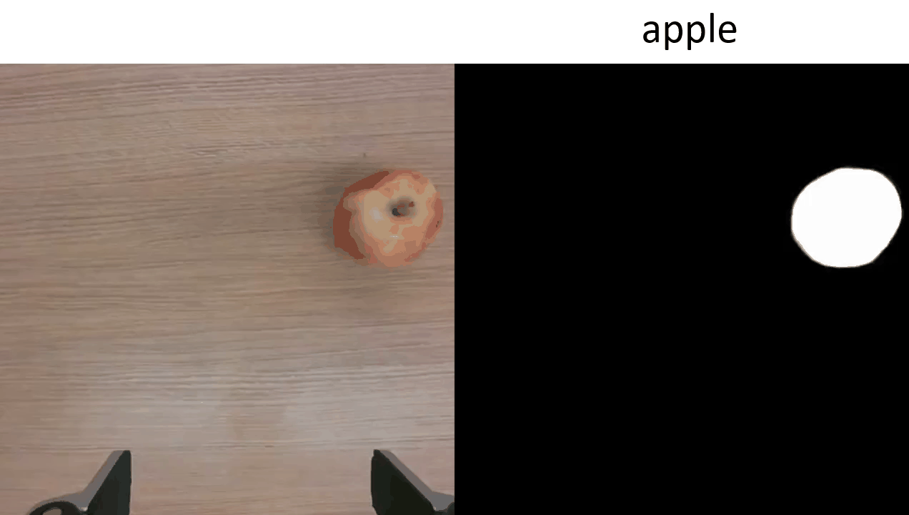

# clipunetr
The repo contains the official PyTorch Implementation of CLIPUNETR.

[[`Paper`](http://arxiv.org/abs/2309.09183)] [[`Demo`](https://github.com/cjiang2/clipunetr/blob/main/notebooks/quick_start.ipynb)]

<p float="center">
  
   
</p>


## Installation
To quickly deploy, clone the repository locally and install with

```
git clone git@github.com:cjiang2/clipunetr.git
cd clipunetr; pip install -e .
```

The model requires `pytorch>=1.7` and `torchvision>=0.8` to function. 

A [modified version of CLIP](https://github.com/cjiang2/clipunetr/blob/main/clipunetr/models/clip/model.py#L244) is embedded in the repo to support multi-resolution image interpolation. 


## Acknowledgement
Thanks to the codebase from [CLIP](https://github.com/openai/CLIP), [CLIPSeg](https://github.com/timojl/clipseg).

Some image resources used in the demo here are from:
- [Spoon, Coffee Bean](https://pixabay.com/photos/coffee-bean-caffeine-coffee-4185338/)
- [Table](https://pixabay.com/photos/food-photography-potato-soup-soup-6282644/)
